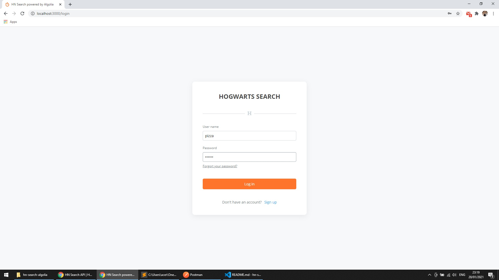
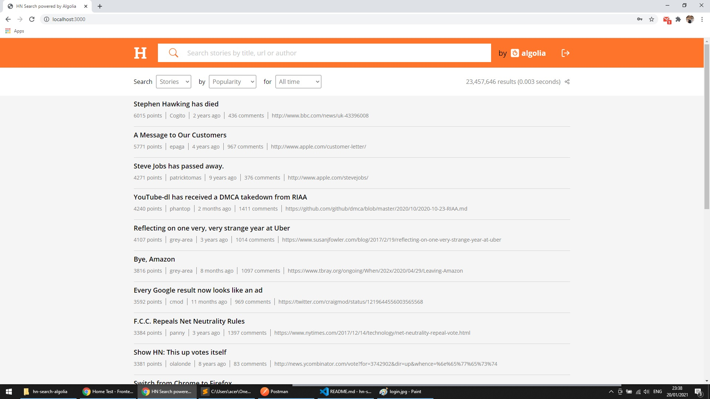
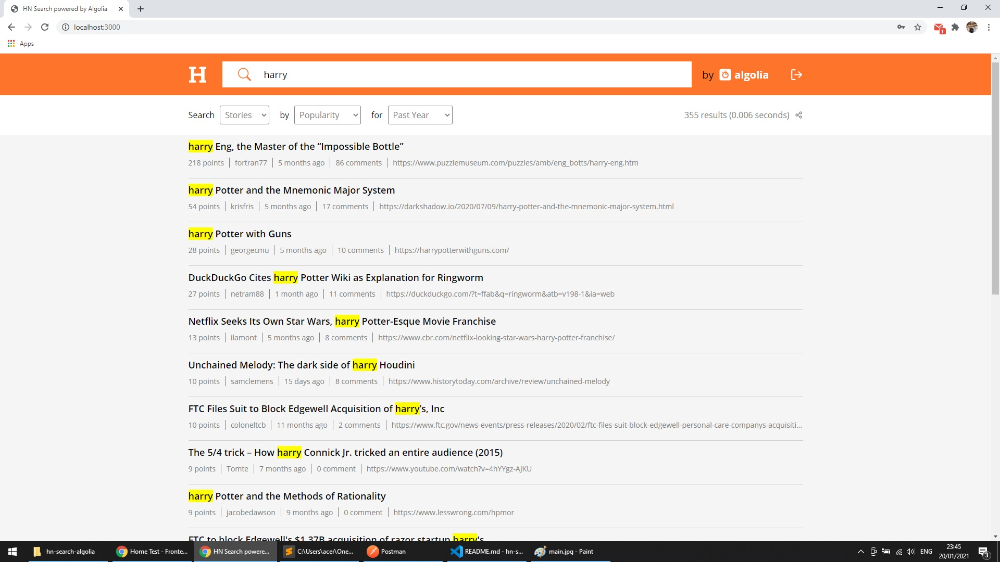
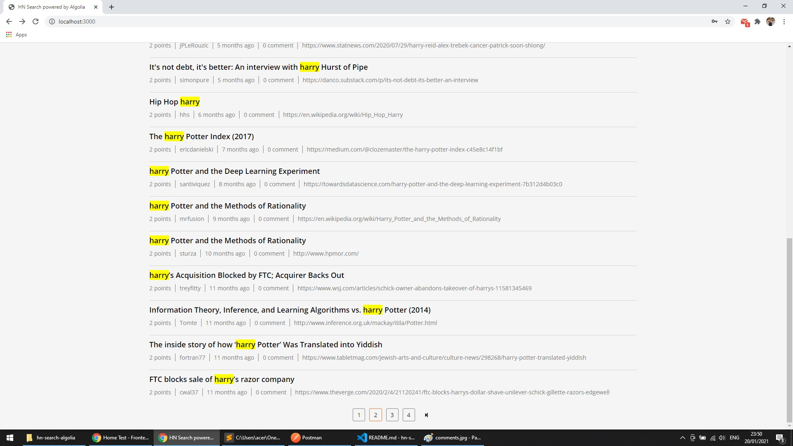
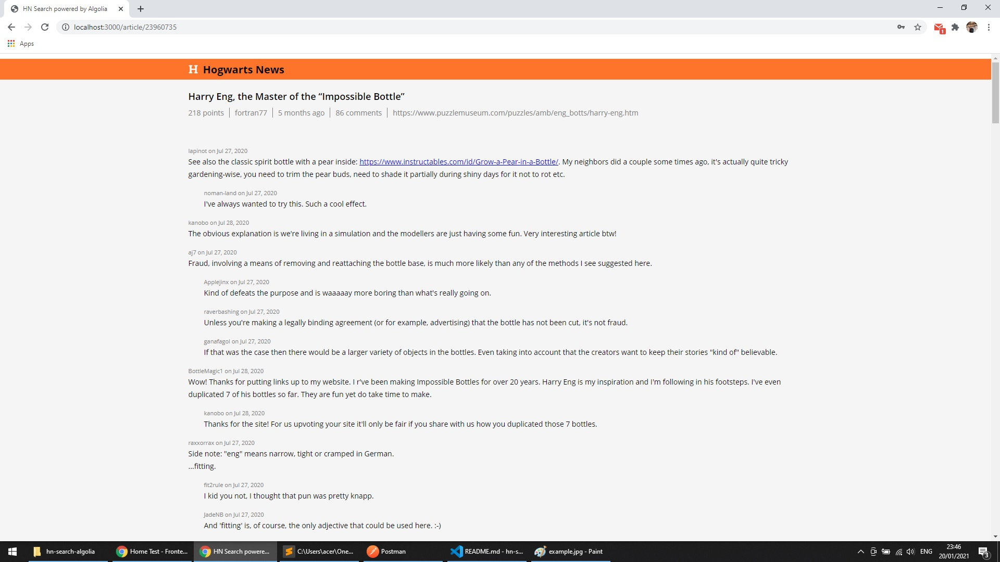
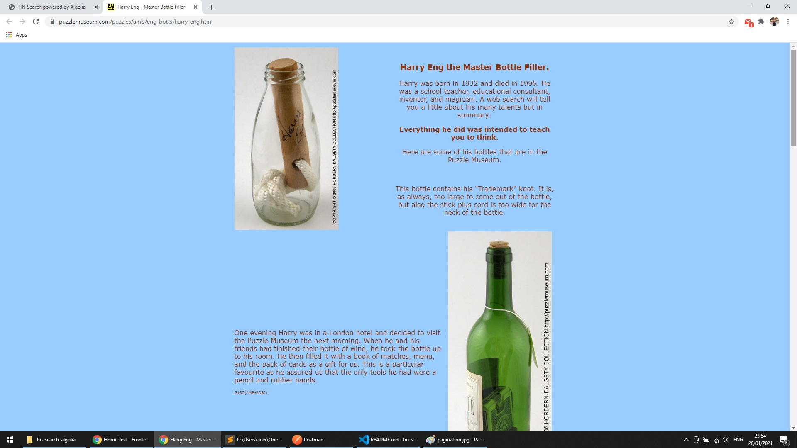

# Hogwarts Search Power by Algolia

A searching web appication using hn.algolia.com API. Built with ReactJS, styled-components, axios, react-icons.

Demo:
 
username: pizza; password: 123456

## Features

- Log-in/out. Keep logging in for 60 minutes, then auto log-out.
- Support search for stories and comments
- Display search results coresponse with filters and default sorted by points.
- Navigate through different pages of the results.
- Highlisht searched key in title and comments.
- Display all the comments coresponse with the article when click on the title.
- Open article's source link in a new tab.
   

## How to use

- Login with username: pizza; password: 123456
- Expiration time (60 mins) will be stored in local storage, app will auto log out after that time.

    

- The main search page will dispay all the results that match search key and filters (default: search all in stories sorted by points in time-range of all time.

    

- Example search: Search for "harry" in stories sorted by points in time-range of past year

    

- Scroll to bottom to navigate through different pages

    

- Click on the title of article to see all comments

    

- Click on the title of article in the comment page to open source link in a new tab

    
